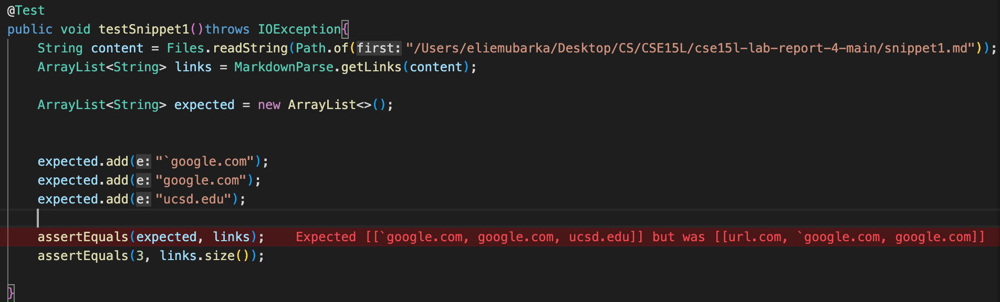

# Lab Report 4

Link of MarkdownParse repo: 
[kgano-ucsd](https://github.com/lithicarus/markdown-parser.git)

Link of my MarkdownParse repo: 
[emubarka](https://github.com/emubarka/cse15l-lab-report-4.git)

# Snipet 1

Testing out the code with 'MarkdownParseTest.java' file:

Results from code from 'MarkdownParse.java':

Result from code of 'kgano-ucsd' of 'MarkdownParse.java':

