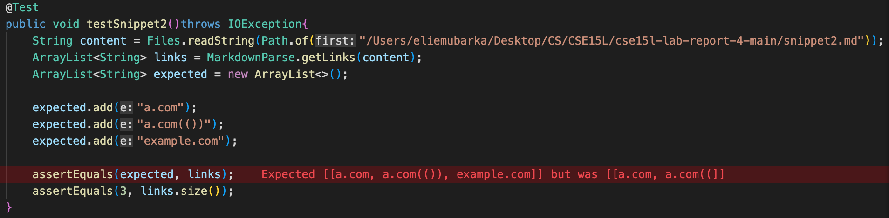
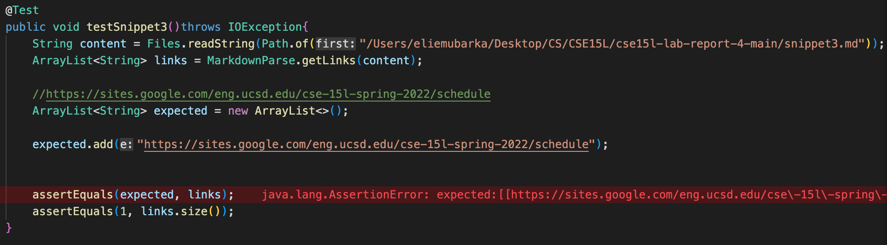

# Lab Report 4

Link of MarkdownParse repo: 
[kgano-ucsd](https://github.com/lithicarus/markdown-parser.git)

Link of my MarkdownParse repo: 
[emubarka](https://github.com/emubarka/cse15l-lab-report-4.git)

# Snippet 1

Testing out the Snippet 1 code with 'MarkdownParseTest.java' file:

Results from my 'MarkdownParse.java':

Result from code of 'kgano-ucsd' of 'MarkdownParse.java':

Both of these tests didn't pass.

---
# Snippet 2

Testing out the Snippet 2 code with 'MarkdownParseTest.java' file:

Results from my 'MarkdownParse.java':

Results from code of 'kgano-ucsd' of 'MarkdownParse.java':

Both of these tests didn't pass.

---
# Snippet 3

Testing out the Snippet 3 code with 'MarkdownParseTest.java' file:

Results from my 'MarkdownParse.java':

Results from code of 'kgano-ucsd' of MarkdownParse.java:

Both of these tests didn't pass.

---
Q: Do you think there is a small (<10 lines) code change that will make your program work for snippet 1 and all related cases that use inline code with backticks? If yes, describe the code change. If not, describe why it would be a more involved change.

A: If I had more time to test out the code change, then yes, I believe the code change could help make the program work for snippet 1 and all related cases that use inline code with backticks. Doing something along the lines of checking the open bracket after the backt tick to see if the boolean comes out as true, then we are able to restart the process to run the code again.

---
Q: Do you think there is a small (<10 lines) code change that will make your program work for snippet 2 and all related cases that nest parentheses, brackets, and escaped brackets? If yes, describe the code change. If not, describe why it would be a more involved change.

A: I don't believe a code change will help make the program work with a small code change as I believe it would require more to try and fix the nested brackets to make the code actually pass. 

---
Q: Do you think there is a small (<10 lines) code change that will make your program work for snippet 3 and all related cases that have newlines in brackets and parentheses? If yes, describe the code change. If not, describe why it would be a more involved change.

A: For a small code change, we can find a new line syntax, and remove the new line and making it into a link line instead. 
